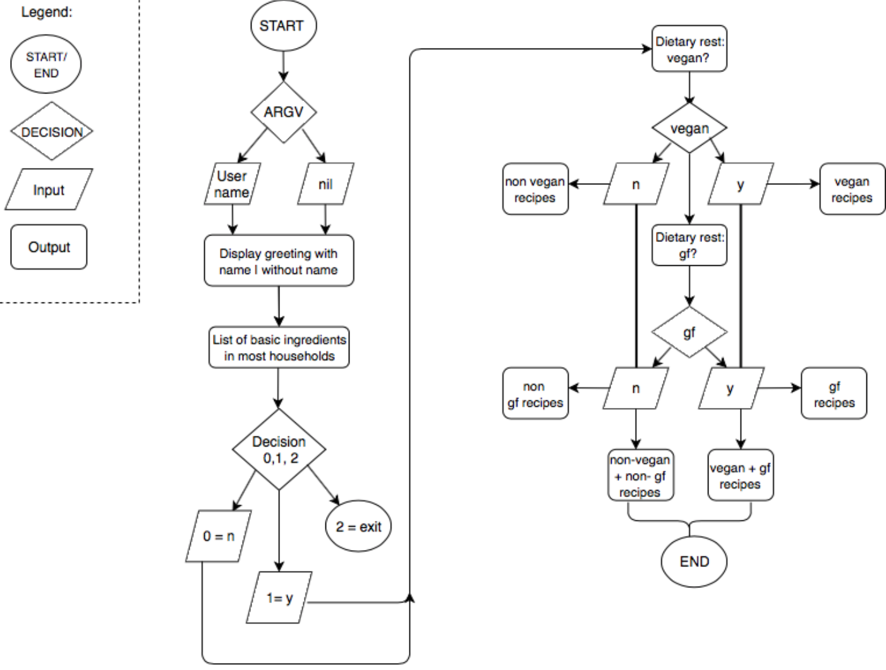
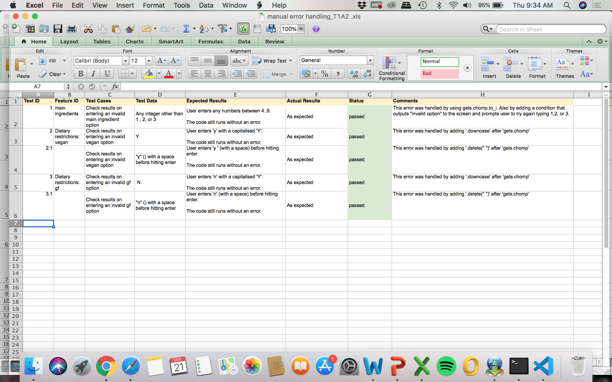
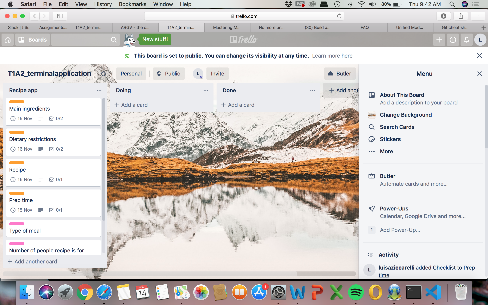
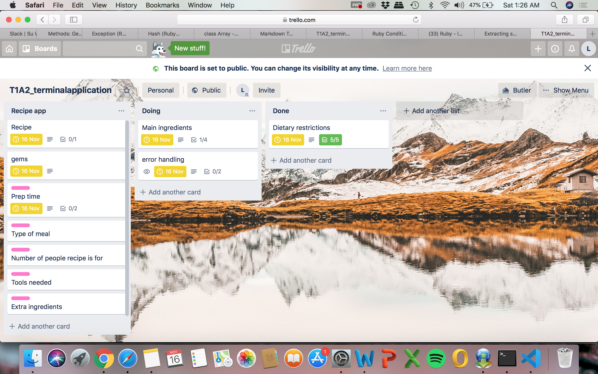

# **My Recipe App**

A basic recipe app that gives you recipe options based on the most commonly found food items in people's kitchens and on your diet restrictions.

# **Contributor**

@luisaziccarelli is a student at Coder Academy, Sydney Campus. She has no prior tech background to this bootcamp and this is her first terminal app using Ruby. 

# **Help** 
## Installation Instructions

- Click the link below and clone the Recipe App git repository to your local computer. You can find Clone or download green tab located on the right upper corner of the repository.

https://github.com/luisaziccarelli/T1A2_terminal_application.git 

- Users has the flexibility to receive a customised welcome message if they choose to enter their name when they try to run My recipe App in the terminal, e.g. 'ruby recipeapp.rb username'. Alternatively, a generic welcome message will display if there is no specific username input.

##  Dependencies 

    - ruby 2.6.3p62 
    - Colorize Gem
    git@github.com:fazibear/colorize.git
    - ASCII Artii 
    git@github.com:miketierney/artii.git

## System/Hardware Requirements

There is no specific system/hardware requirement for this application.

# **Software development plan** 

# Statement and scope: 

•   My Recipe App is a CLI application written in Ruby, which can be easily run on the command line. There are a lot of recipe websites, pinterest, and other apps you can use to find new recipes. But with so many options out there this process can become rather overwhelming and time consuming. I wanted to create a basic app that would simplify this process for users and would help them find interesting recipes based on items or ingredients they have available in their kitchen. 

•   Most of us these days struggle to find the time to plan ahead our shopping lists, let alone to come up with new ideas or recipes. Developers are no exception. So I have come up with an app that can take input on the items you already have and provide with recipe ideas to tackle this problem. 

•   The target audience for this app is anyone looking for new ideas on recipes they can make when they only have a few ingredients at hand and limited time to go shopping. The user will need to have at least a few items of food available at hand. 

•   The user would be asked input about what ingredients they have at hand and also about the meal they are looking to make (dietary restrictions). The program will output the recipe that matches their input. 

# Features
- Key features: 
    - Feature 1: **Main ingredients**  
    The program starts by asking input from the user on the items of food the user has available in their kitchen. The program provides a list of the items typically found in most households. The user has the option to choose from 3 options: 1) yes, they have at least one item available; 2) no they do not have the items available but would still like to proceed; and 3) an exit option. 
    - Feature 2:  **Dietary restrictions**  
    This program asks user inputs on whether they have any dietary restrictions. For the purpose of this program the dietary restrictions considered were: vegan and gluten free. The user is asked input separately for each category. The program then would use the information stored in these variables to work out all the possible combinations through the use of loops and conditional control structures.
    - Feature 3: **Recipe**  
    This program will output a recipe or a Step-by-step cooking instructions on how-to make the given meal or meals that meet the user's specifications. The program will include 5 recipes for all types of dietary restrictions and its combinations. Through a method the program will choose the given recipe that matches the user's dietary restrictions. 
   
- Addional features: 
    - Feature 4:  **Prep time**  
    The program will also output an indication of the time it will take the user to make the meal.

# User Interaction Experience 

- Feature 1: The program will outut a list with the most commonly found items in people's kitchens. The user would be asked to choose between three options: 1) To type yes if they at least have of the ingredients and continue; 2) to type no if they do not have any of the ingredients but they would still like to continue; and 3) to exit the program. 

- Feature 2: Nowadays there is a wide range of dietary restrictions and preferences, for instance vegetarian, pescatarian, etc. However for the purpose of this program the user will be given only two options in terms of dietary restrictions: vegan and gluten free. The program ask for input individually and will display the user's choice back. This program will account for combinations of these dietary restrictions, so for example: a user could be vegan but not gluten free, or viceversa. The program will account for these possible combinations and will output the user's selections.  

- Feature 3: The major feature of this program is for the user to get access to recipes they can make with basic ingredients. This feature has been designed to include and output a few different elements pertaining to the recipe, including: name of the recipe, preparation time, and more importantly instructions on how to make the meal. The program will use a method to match the user's dietary restrictions to the recipes available. The final output would be a couple of recipes that meet the user's dietary restrictions. 

# Error Handling

- When getting user input we could expect some errors will occur. For example typing errors or entering a variable value that does not exist within our program. These erros will be handled by using exceptions. 

- The begin, rescue and end exception is used to handle the TypeError. 

# Control Flow Diagram

- The control flow diagram below represents the control flow for this application. 

https://drive.google.com/file/d/1SvOF-qzdGLOB5OC62fmNSPHBv_euI1Bx/view?usp=sharing

 

# Implementation Plan

|Feautures           | Checklist                                         | Priority | Deadline    |
|---                 |---                                                |---       |---          |
| Main Ingredients   | Print to screen                                   |   High   |  15/11/19   |
|                    | Get user input                                    |          |             |
|                    | Create variable with user input                   |          |             |
|                    | Create a method                                   |          |             |
|Dietary Restrictions| Get input  (vegan, gf)                            |   High   |  15/11/19   |    
|                    | Create variable with user input                   |          |             |
|                    | Create method that outputs their diet restriction |          |             |
|                    | Create method that outputs possible combinations  |          |             |
|Recipes             | Create array of hashes with recipes               |   High   |  16/11/19   | 
|                    | Create a loop to loop over array of hashes        |          |             |
|                    | Create a method to print recipe                   |          |             |
|                    | Add a gem                                         |          |             |
|Test, ARGV, bash    | Error handling with exceptions                    |  Medium  |  19/11/19   |
|script              | Create ARGV array                                 |          |             |
|                    | Create bash script                                |          |             |

# Development Log and Status Updates

- 14/11/2019. Status update 1: Design and plan

The first roadblock I encountered during the design and planning process was about how the user would interact with the main 3 features of my program: ingredients available, ditary restrictions and recipes. I was unsure how to handle the ingredients the user had available variable. If we think about it the list of items of food someone can have is endless. The second roadblock was the number of recipes the program had. Then I also wanted to make sure the recipes would match the user's dietary restrictions and also the items they had available. The way I addressed these roadblocks was by approaching my educator, who helped me simplify my program to get started. I decided to provide the user with options for the the ingredients available variable and decided to focus on the dietary restrictions first and then the recipes. This process for me was a good reminder of the importance of approaching a problem one step at a time and starting small without getting caught up in the big picture. 

- 18/11/2019. Status Update 3: Coding

When I started coding the first roadblock I found was when I was creating the conditionals for my dietary restrictions variable. I used logical operators to compare 2 conditions at a time, this gave me an error. This was a good opportunity to review my understanding of these concepts. Also in doing this and creating my first loop I realize I needed to review the syntax for the if/else statments. Once I figure this out creating the other methods in the program was a little bit more easy. Another roadblock I found was when it came to outputting recipes, I realized matching both the ingredients and the recipes would be a little too complicated, so I decided to concentrate in one variable only (dietary restrictions). In terms of displaying the recipes I would have liked to use APIs or another tool to make my code DRY, however I found the easiest way at my skill level I had to do this was to have the recipes in the code itself.  

# Aplication Implementation 

All three main feautures outlined in my development plan were implemented. Even though they ended up being implemented in a much less simple and sofisticated way that I originally intended, these feature comply with the must have programming concepts and structures required for this project (e.g. variables, loops, conditional control structures, error handling, error handling, input and output, ARGV, command line arguments, and Ruby Gems).

# Manual error handling tests
- As part of the test application I also manually tested the application ran as expected if minor errors were to occur. See the below screenshot of these potential erros and how they were handled.  

# Developer Operations 

- Github was utilized as a source control throughout the development of this application, with a total of X commits, which were pushed into a remote repository. Please refer to the link below:
https://github.com/luisaziccarelli/T1A2_terminal_application.git

# Project Management

- The project management tool used for this project was Trello, which ilustrates the project planning status, tasks breakdown and prioritization, and deadlines. Check the Trello board for this project by clicking on this link: https://trello.com/b/IHXfd7cY/t1a2terminalapplication

Below are some screenshots of the Trello board for this project: 

# Project Package

- A bash scrip (my_script.sh) was written to run the application. All relevant ruby files are linked and gems were installed installed.

